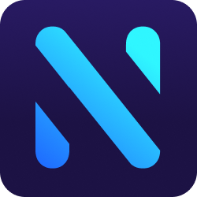
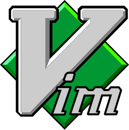

	

<b><a href="https://github.com/golang/go">Gopher</a></b>
•
<b><a href="https://github.com/neovim/neovim">(Neo)Vimer</a></b>
•
<b><a href="juan1014166@gmail.com"> Email me</a></b>

	
	
	
	
	

	<b>A Gopher that is on the way to being full stack, delving into the frontend and hand in hand with tests with typescript</b>

###  Vim stuffs
  - [nvim](https://github.com/NikolaM-Dev/dotfiles/tree/main/.config/nvim) My personal neovim config with lots of person hack and all written in vimscript.

###  vscode stuffs
- [nikola-snippets](https://github.com/NikolaM-Dev/nikola-snippets) All the snippets you'll need.

 

### Hi i'm Juan David

- 🔭 I'm currently working on [**Moldy**](https://github.com/Moldy-Community)
- 🌱 I’m currently learning Backend with [`NodeJS`](https://nodejs.org/en/) with [`TypeScript`](https://www.typescriptlang.org/)
- 🥅 2021 Goals: Learn backend con Node/ts and frontend React/ts ⚛️
- ⚡ Fun fact: I love sports 🏋️‍♂️, playing video games 🎮 and socializing💃

 

### Connect with me

- [📧 **Email**](juan1014166@gmail.com)
- [🐦 **Twitter**](https://twitter.com/nikolam_dev)
- [📸 **Intagram**](https://www.instagram.com/nikolam_dev)
